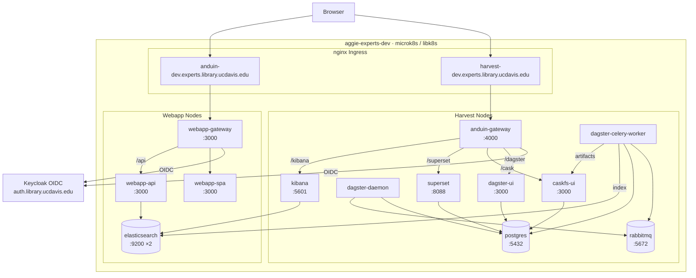

# Dev Cluster (Kubernetes)

The dev environment runs on a microk8s cluster (`libk8s`) in the `aggie-experts-dev` namespace, managed with Kustomize overlays via `cork-kube`.

Accessible at: https://anduin-dev.experts.library.ucdavis.edu

## Service Topology



## Prerequisites

- [cork-kube](prerequisites.md#cork-kube) installed
- [gcloud CLI](prerequisites.md#gcloud-cli) installed
- [kubectl](prerequisites.md#kubectl) installed
- GCP access to project `aggie-experts` with Secret Manager read permissions (required to pull the kubeconfig and k8s secrets)

Contact the project lead if you need access.

## First-Time Setup

### 1. Register the project with cork-kube

From the root of this repo:

```bash
cork-kube project set -c .cork-kube-config
cork-kube project set -e [your-email-address]
```

### 2. Activate the dev environment

Authenticates gcloud and configures kubectl with the dev cluster kubeconfig (fetched from GCP Secret Manager):

```bash
cork-kube init dev
```

You will be prompted to confirm your GCP account. This command also verifies your GCP credentials are valid before proceeding.

### 3. Deploy all services

Creates the `aggie-experts-dev` namespace if it does not exist, syncs all secrets from GCP Secret Manager into the cluster, and applies all Kustomize overlays:

```bash
cork-kube up dev
```

To deploy only a specific service group:

```bash
cork-kube up dev -g anduin    # Dagster, CaskFS, Superset, gateway
cork-kube up dev -g webapp    # webapp gateway, SPA, API
```

To deploy a single service:

```bash
cork-kube up dev -s postgres
```

### 4. Initialize databases (first run only)

After all pods are running, exec into a Celery worker pod to initialize the Elasticsearch indexes, PostgreSQL schema, Dagster metadata database, and CaskFS cache:

```bash
cork-kube pod exec dev dagster-celery-worker -e "experts init"
```

This is only required on the first deployment or after a full namespace teardown.

## Updating the Cluster

When new image versions are available, update the kustomize overlays and apply them. See [Updating Deployments](updating-deployments.md) for the full release workflow.

Quick apply after image tags have been updated in this repo:

```bash
cork-kube up dev
# or for a specific group:
cork-kube up dev -g webapp
```

## Stopping Services

```bash
cork-kube down dev
# or for a specific group:
cork-kube down dev -g anduin
```

## Checking Status

```bash
cork-kube init dev
kubectl get pods
kubectl get services
```

## Redeploying a Single Service

To force-delete and redeploy a service (useful when a pod is stuck):

```bash
cork-kube up dev -s dagster-celery-worker -r
```

## Service Groups

Services are organized into groups as defined in `.cork-kube-config`:

| Group | Services |
|---|---|
| `anduin` | dagster-daemon, dagster-celery-worker, dagster-ui, caskfs-ui, anduin-gateway, superset, volumes |
| `webapp` | webapp-gateway, spa, api |
| _(no group)_ | app-env (configmap), postgres, rabbitmq, elasticsearch, kibana |
